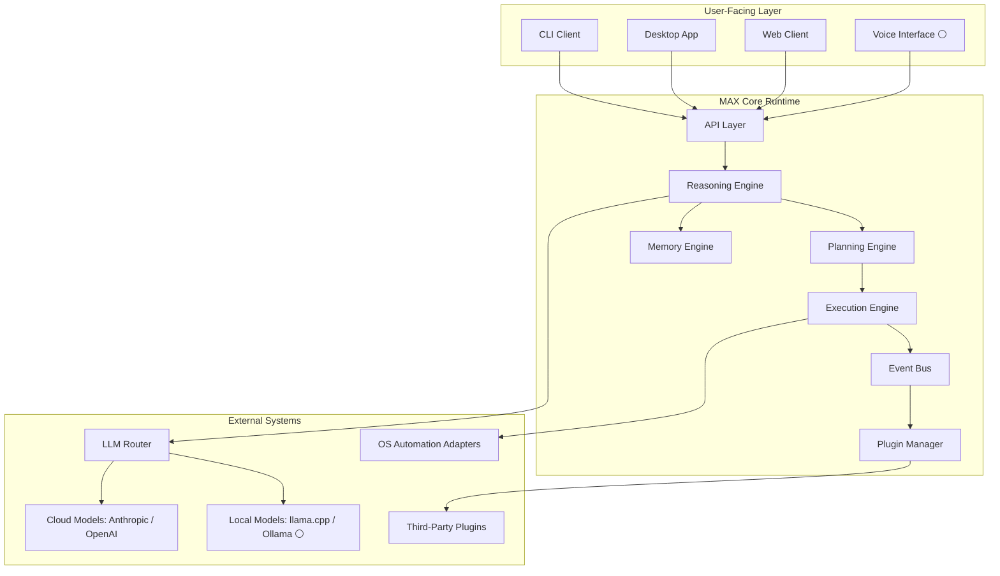
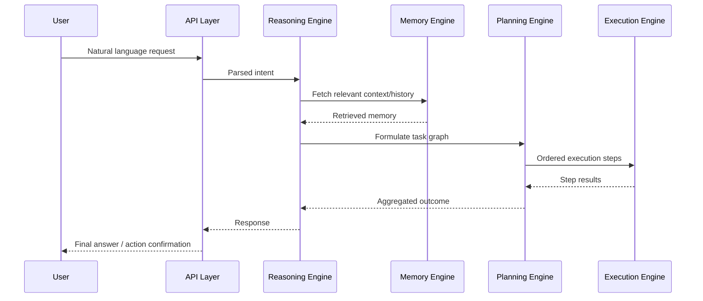
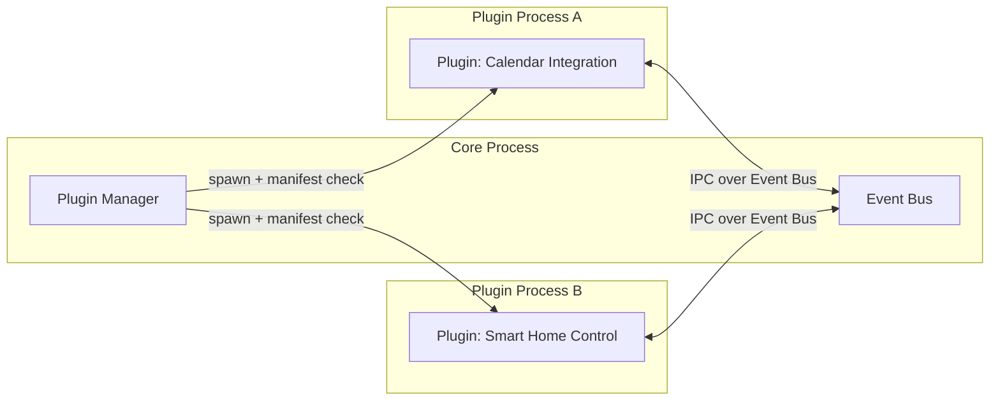

# MAX AI OS — Architecture Specification

**Status legend used throughout this document:** 🟢 Implemented · 🟡 In Progress · ⚪ Planned

> Scope note: MAX AI OS is pre-1.0. Where this document describes subsystems as if fully realized, treat that as the target design, not a claim of current state. Each section marks status explicitly. Do not remove these markers as the project matures — update them.

## 1. Why an "AI Operating System" and not an "AI Assistant"

An assistant answers questions. An operating system arbitrates resources, schedules work, enforces security boundaries, and provides a stable interface that other software builds on. The distinction matters architecturally, not just semantically:

- An assistant is a single request/response loop. MAX AI OS is a **long-running process** with persistent state, multiple concurrent agents, and a scheduler.
- An assistant has no notion of "capabilities" beyond what's in its context window. MAX AI OS has a **plugin/capability registry** with permission scoping, similar to how a kernel manages device drivers.
- An assistant is stateless between sessions. MAX AI OS is built around a **memory engine** that persists across restarts and informs future reasoning.

This framing drives real engineering decisions below (process isolation for plugins, an event bus instead of direct function calls, a permission model instead of "the LLM can just call anything").

## 2. System Overview

**Why an event bus instead of direct calls between engines?** Direct coupling (Reasoning → Execution → Memory as function calls) makes it impossible to add observers later — logging, undo/redo, multi-agent coordination, or a future permissions auditor all need to see events without the emitting component knowing they exist. This is the same reasoning behind Redux, Kafka-based microservices, and OS-level interrupt handling: decouple producers from consumers.

## 3. AI Core

The AI Core is the coordination layer between raw LLM calls and the rest of the OS. It does **not** call models directly — that's the LLM Router's job (Section 8). The AI Core's responsibility is turning a user intent into a sequence of engine invocations.

## 4. Reasoning Engine ⚪

**Problem it solves:** Raw LLM completions are single-shot and stateless. The Reasoning Engine wraps the LLM Router with intent classification, context assembly, and multi-step decomposition so the rest of the system receives a structured task, not a raw text blob.

**Responsibilities:**
- Intent classification (query vs. command vs. multi-step task)
- Context assembly (pulling relevant memory before calling the model)
- Delegation to Planning Engine for anything requiring more than one execution step
- Confidence scoring on ambiguous requests (defer to user clarification rather than guessing silently)

**Current implementation:** A single-pass prompt pipeline with basic intent tagging. No multi-agent debate/self-critique loop yet.

**Planned architecture:** Pluggable reasoning strategies (ReAct-style, tree-of-thought for complex planning tasks) selected based on task complexity score, not hardcoded per-request.

## 5. Memory Engine ⚪

**Problem it solves:** LLM context windows are finite and expensive. Without a memory layer, every session restarts from zero and every long conversation eventually truncates useful history. The Memory Engine is a persistence and retrieval layer, not "a bigger context window."

| Memory Tier | Purpose | Storage (planned) |
|---|---|---|---|
| Working memory | Active task state, current conversation | Redis |
| Episodic memory | Past interactions, timestamped | PostgreSQL + pgvector |
| Semantic memory | Facts, preferences, learned associations | Vector DB (Qdrant/Weaviate) |
| Procedural memory | Learned automation routines | Structured task templates in Postgres |

**Why tiered memory instead of "dump everything in a vector DB"?** Semantic search over undifferentiated memory returns noisy results — a user's five-year-old one-off question ranks the same as yesterday's stated preference. Tiering lets retrieval logic weight recency, frequency, and type differently, which is closer to how retrieval-augmented systems in production (e.g., long-context agent frameworks) actually behave.

## 6. Planning Engine ⚪

**Problem it solves:** A single LLM call cannot reliably execute "reorganize my downloads folder, then email me a summary" — that requires decomposition into ordered, dependency-aware steps with failure handling at each stage.

**Planned design:** Task graph representation (DAG) where each node is an Execution Engine capability invocation. Failure at any node triggers either retry, replanning, or escalation to the user — not silent partial completion.

## 7. Execution Engine ⚪

**Problem it solves:** Turns a planned step into an actual side effect — a file operation, an API call, a desktop automation action. This is the only layer allowed to touch the outside world; Reasoning and Planning never execute directly. That separation exists so every side effect passes through one auditable choke point (logging, permission checks, dry-run mode).

**Current implementation:** Direct Python function dispatch for a small set of built-in capabilities (file operations, shell commands with allowlisting).

**Planned architecture:** Capability contracts (typed input/output schema per action) registered by plugins, executed in a sandboxed subprocess per capability class.

## 8. LLM Router ⚪

**Problem it solves:** Hardcoding "call OpenAI" or "call Anthropic" throughout the codebase makes model swaps, fallback logic, and cost-based routing impossible. The Router is the single integration point.

**Responsibilities:**
- Route requests to cloud (Anthropic, OpenAI) or local (llama.cpp, Ollama ⚪) models based on task requirements (latency, cost, privacy)
- Normalize responses across providers into one internal schema
- Handle retries/fallback if a provider is unavailable

## 9. Plugin Architecture ⚪

**Problem it solves:** A monolithic OS core that hardcodes every integration (calendar, email, smart home) doesn't scale and can't be safely extended by third parties. Plugins need a permission model or a malicious/buggy plugin can do anything the host process can do.

**Planned design:**
- Each plugin declares required capabilities (filesystem, network, specific APIs) in a manifest — similar to Android's permission model or a browser extension manifest.
- Plugins run in a separate process (not in-process Python import) so a crash or infinite loop can't take down the core runtime.
- Communication with the core happens exclusively through the Event Bus — no shared memory, no direct imports of core internals.

## 10. Agent Communication & Event System ⚪

**Why an internal pub/sub system:** Multiple engines and plugins need to react to the same event (e.g., "task completed") without tight coupling. The Event Bus is currently an in-process async pub/sub (Python `asyncio` queues); it is designed so it can be swapped for a real message broker (Redis Streams or NATS) once MAX AI OS needs multi-machine deployment without changing the emitting code.

## 11. API Layer ⚪

**Current implementation:** A REST/WebSocket API (FastAPI) exposing intent submission, task status polling, and streaming responses. This is the boundary all clients (CLI, desktop, web) use — none of them talk to internal engines directly, which keeps the client surface stable even as internals change.

## 12. Desktop Automation ⚪

**Problem it solves:** Many useful tasks ("organize my files," "fill this form") require OS-level control, not just API calls. Planned adapters: Windows (`pywinauto`/UI Automation), Linux (`xdotool`/AT-SPI), with a common abstraction so Planning Engine steps don't need OS-specific logic.

## 13. Cloud Architecture ⚪

**Planned:** Optional cloud-hosted deployment for the core runtime with the same API surface as the local install, so a client (mobile, web) can talk to either a local instance or a hosted one interchangeably. Not implemented — current deployment target is single-machine local.

## 14. Security Model

**Problem it solves:** An AI system that can execute filesystem/shell/automation actions is a meaningful attack surface if it will execute arbitrary plugin or model-generated instructions without checks.

| Layer | Current                 | Planned |
|---|-------------------------|---|
| Plugin permissions | None — trusted code only | Manifest-declared capability scoping |
| Execution sandboxing | Command allowlist       | Per-capability subprocess sandbox |
| Secrets management | `.env` file             | OS keychain integration / vault |
| Model output validation |  None                   | Schema-validated action outputs before execution; no raw LLM text executed as code/shell |
| Audit logging |  Basic file logging    | Structured, queryable execution audit trail |

**Explicit non-goal for now:** MAX AI OS does not currently sandbox at the OS-process-permission level (e.g., no seccomp/AppArmor profiles). This is a known gap, not an oversight — see `docs/roadmap.md` for when it's addressed.

