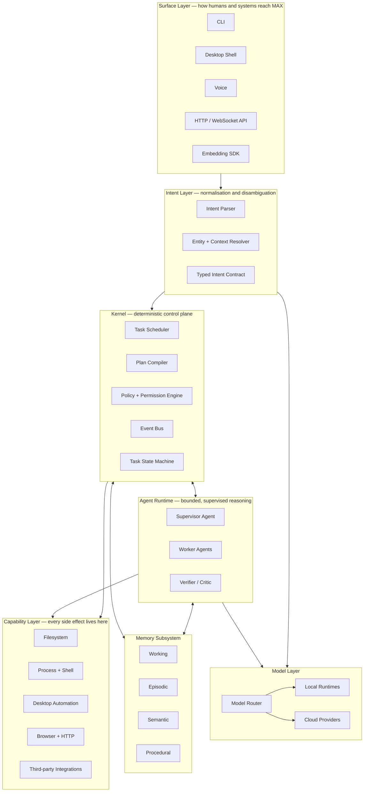
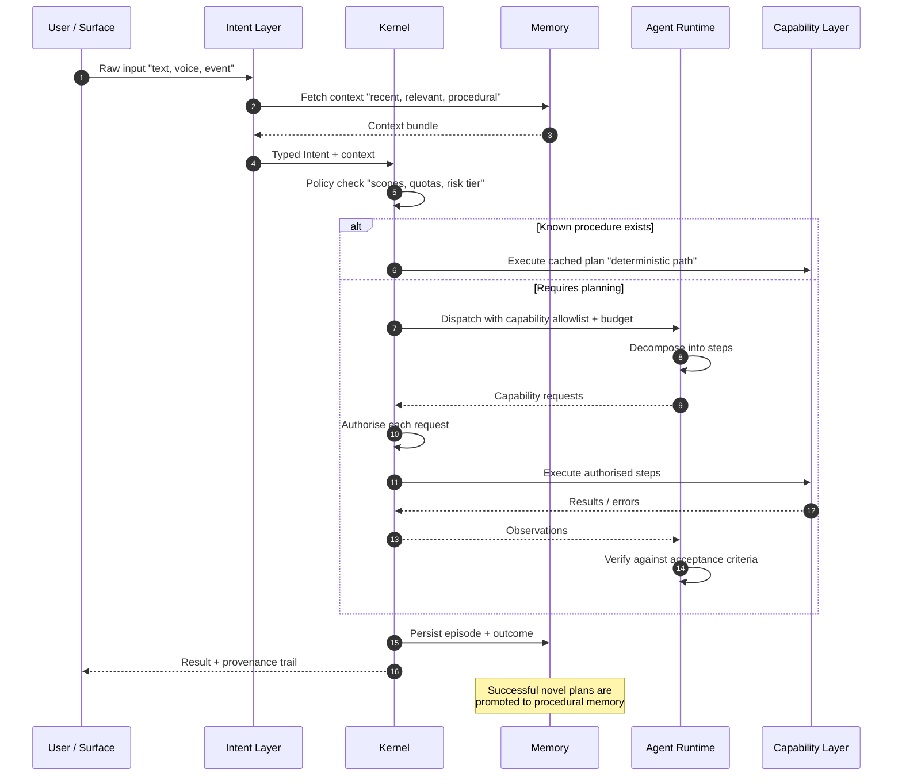
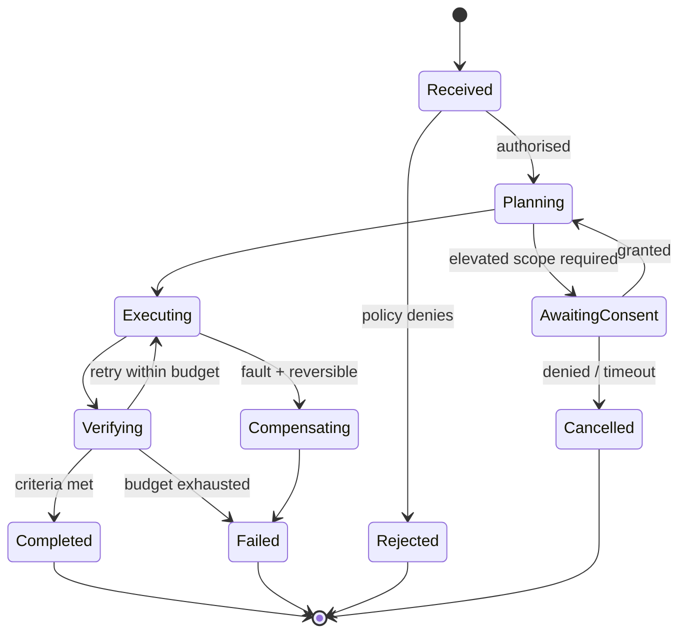
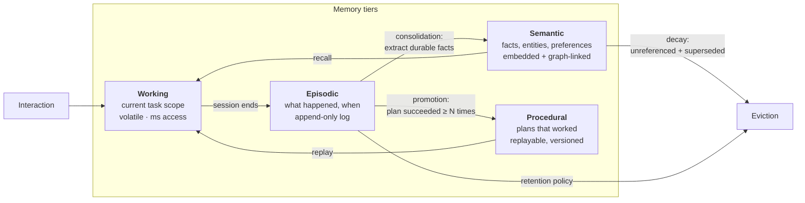
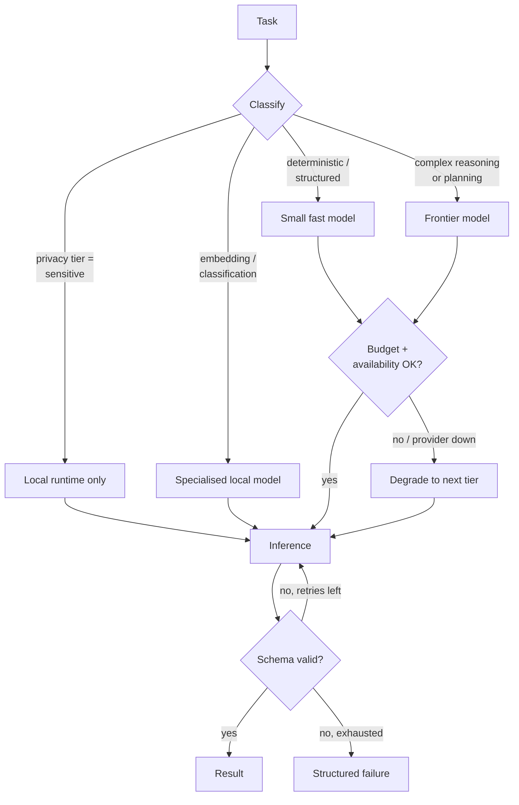
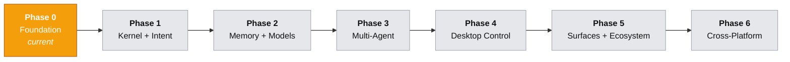

<div align="center">

# MAX AI OS

**An intelligent software layer that turns user intent into verified action.**

MAX is an AI Operating System: a kernel, memory subsystem, agent runtime, and capability layer
that sit between a human and the machines they use — local desktops, cloud services, and eventually
mobile and embedded targets.

[](#current-project-status)
[](#roadmap)
[](#technology-stack)
[](#license)
[](#contributing)

</div>

> **Read this first.** MAX AI OS is at **Phase 0**. This repository currently contains project
> scaffolding only — no runtime code has been committed yet. Everything below is either
> **[Implemented]**, **[In Progress]**, or **[Planned]**, and every section is labelled accordingly.
> This README is the architectural specification the implementation will be built against, not a
> description of a finished system. See [Current Project Status](#current-project-status).

---

## Table of Contents

- [Vision](#vision)
- [What MAX Is Not](#what-max-is-not)
- [Architecture Overview](#architecture-overview)
- [Key Capabilities](#key-capabilities)
- [Technology Stack](#technology-stack)
- [Development Philosophy](#development-philosophy)
- [Current Project Status](#current-project-status)
- [Roadmap](#roadmap)
- [Repository Structure](#repository-structure)
- [Getting Started](#getting-started)
- [Future Goals](#future-goals)
- [Contributing](#contributing)
- [License](#license)

---

## Vision

Operating systems have always been intent translators. A shell translates a typed command into a
process. A window manager translates a click into a focus change. Every layer exists because the
layer below it is too low-level for the human above it.

That translation chain stops one level too early. The gap between *"what I want"* and *"the exact
sequence of applications, files, APIs, and commands that produce it"* is still work the human does
manually — and it is the majority of what people actually do at a computer.

MAX AI OS is an attempt to close that gap with a real systems design rather than a chat window.

**The thesis:** a language model is a reasoning component, not an architecture. To be useful as an
operating layer it needs the things operating systems have always provided — persistent state,
scheduling, isolation, a permission model, a capability registry, and a deterministic control plane
that does not hallucinate. MAX supplies those. The model plans; the kernel executes, verifies, and
is accountable for the result.

**Three principles the design is derived from:**

| Principle | Consequence in the design |
| --- | --- |
| **Intent is the primary abstraction** | The public interface is a typed `Intent`, not a prompt string. Every surface — CLI, desktop, voice, HTTP — compiles to the same structure, so behaviour is identical across them. |
| **Memory is infrastructure, not a feature** | Recall is a tiered subsystem with defined promotion, decay, and eviction policy — not an unbounded vector dump appended to a context window. |
| **Autonomy requires accountability** | Every action is a declared capability, permission-scoped, logged, and reversible where physically possible. An agent cannot do anything the kernel has not granted. |

---

## What MAX Is Not

Stated explicitly, because the category is crowded and the distinctions are load-bearing.

| MAX is not | Because |
| --- | --- |
| A chatbot with tools bolted on | Conversation is one surface among several. The kernel is usable with no natural-language input at all. |
| A replacement for Windows or Linux | MAX runs *on* an OS and mediates access to it. There is no bootloader, scheduler-for-processes, or driver model in scope. "OS" describes the abstraction layer, not the ring. |
| A single-model wrapper | Model selection is a routing decision made per task class, per privacy tier, per cost budget. Providers are pluggable and replaceable. |
| An autonomous agent that runs unsupervised by default | Default posture is least-privilege with explicit escalation. Full autonomy is an opt-in policy, not the starting state. |
| A prompt-engineering framework | Prompts are implementation detail inside capability handlers. The contracts between subsystems are typed schemas. |

---

## Architecture Overview

MAX is a layered system with a deterministic control plane. The rule that shapes everything:
**non-determinism is confined to planning; execution is deterministic, typed, and auditable.**

### System layers



### Layer responsibilities

| Layer | Responsibility | Explicitly not responsible for |
| --- | --- | --- |
| **Surface** | Transport, authentication, rendering, streaming | Interpreting meaning |
| **Intent** | Turning ambiguous input into a validated, typed `Intent` | Deciding how to achieve it |
| **Kernel** | Scheduling, permissions, plan compilation, state transitions, audit | Reasoning about the world |
| **Agent Runtime** | Decomposition, tool selection, self-correction within a bounded budget | Direct side effects — it may only *request* capabilities |
| **Capability** | All I/O and side effects, behind declared, permission-scoped manifests | Deciding when to act |
| **Memory** | Durable state, retrieval, consolidation, decay | Interpreting retrieved content |
| **Model** | Inference, routing, cost/latency/privacy trade-offs | Anything stateful |

The critical constraint: **agents cannot perform side effects.** They emit capability *requests*
that the kernel authorises, executes, and records. This makes the trust boundary a code boundary
rather than a prompt instruction, and it is the difference between a system you can audit and one
you can only hope behaves.

### Request lifecycle



Two properties fall out of this shape:

1. **Repeat work gets cheap.** A plan that succeeded once is promoted to procedural memory and
   replayed deterministically — no model call, no latency, no token cost, no variance.
2. **Failures are attributable.** Every step carries the intent, the authorising policy, the
   capability invoked, and the observed result. Debugging a bad outcome is log analysis, not
   prompt archaeology.

### Task state machine



Budgets are explicit and enforced by the kernel: wall-clock, token spend, retry count, and
capability-invocation count. An agent cannot loop indefinitely because the control plane, not the
agent, owns the loop.

### Memory subsystem

Retrieval-augmented prompting is not a memory architecture. MAX models memory as tiers with
distinct lifetimes, access patterns, and consolidation rules.



| Tier | Contents | Lifetime | Primary read path |
| --- | --- | --- | --- |
| Working | Active task state, in-flight observations | Task duration | Direct reference |
| Episodic | Timestamped record of interactions and outcomes | Retention-policy bound | Temporal + filtered scan |
| Semantic | Stable facts, entities, relationships, preferences | Until superseded or decayed | Hybrid: vector + keyword + graph traversal |
| Procedural | Validated plans, parameterised and versioned | Until invalidated by failure | Exact + similarity match on intent signature |

Design decisions worth stating, with the reasoning:

- **Hybrid retrieval over pure vector search.** Vector similarity fails on exact identifiers, negation,
  and recency — all common in personal context. Keyword and graph paths cover what embeddings miss.
- **Consolidation is a scheduled background job, not an inline write.** Extracting durable facts on
  the request path adds latency and cost to every interaction while producing lower-quality facts
  than a batch pass with fuller context.
- **Decay is mandatory.** Unbounded memory degrades retrieval precision as it grows. Facts carry
  confidence and last-referenced metadata; the eviction pass is part of the design, not a later fix.

### Model routing



Routing is policy-driven configuration, not hardcoded. Three properties matter: sensitive data can
be pinned to local inference and never leaves the machine; provider outages degrade rather than
fail; and cost is bounded per task rather than discovered on the invoice.

---

## Key Capabilities

All items are **[Planned]** unless marked otherwise — see [Current Project Status](#current-project-status).

### Core platform

| Capability | Description | Status |
| --- | --- | --- |
| Intent compilation | Any surface input → single validated, typed intent contract | Planned — Phase 1 |
| Deterministic kernel | Scheduling, policy enforcement, task state machine, audit log | Planned — Phase 1 |
| Tiered memory | Working / episodic / semantic / procedural with consolidation and decay | Planned — Phase 2 |
| Capability registry | Declarative manifests: input schema, permission scopes, reversibility, risk tier | Planned — Phase 2 |
| Multi-agent orchestration | Supervisor / worker / verifier with kernel-enforced budgets | Planned — Phase 3 |
| Model routing | Local + cloud, privacy-tier pinning, cost budgets, graceful degradation | Planned — Phase 2 |
| Procedural replay | Successful plans cached and re-executed without inference | Planned — Phase 3 |
| Desktop automation | Filesystem, process, window, and application control on Windows and Linux | Planned — Phase 4 |
| Full audit trail | Every action traceable to intent, policy decision, and observed outcome | Planned — Phase 1 |

### Security and safety model

Not a later hardening pass — a Phase 1 requirement, because retrofitting a permission model onto a
system that already has side effects is close to impossible.

| Control | Mechanism |
| --- | --- |
| Least privilege | Capabilities are granted per task from an explicit allowlist, not held globally |
| Permission scopes | Android-style scopes; elevated scopes require interactive consent |
| Risk tiering | Capabilities declare `read` / `write` / `destructive` / `external`; destructive requires confirmation |
| Reversibility | Manifests declare whether an action is reversible and how; the kernel prefers reversible paths |
| Sandboxing | Untrusted execution runs in isolated processes with constrained filesystem and network views |
| Prompt-injection containment | Retrieved and web content is untrusted data; it cannot grant capabilities, only be reasoned about |
| Secret isolation | Credentials resolve inside the capability layer and are never placed in model context |

The prompt-injection stance is worth expanding, since it is where most agent systems break: because
agents can only *request* capabilities and the kernel authorises against a per-task allowlist,
malicious text in a document or webpage cannot escalate privilege. The worst case is a wasted task
and a logged denial, not an unauthorised action.

---

## Technology Stack

Choices are recorded with reasoning. Anything not yet committed to is marked **Candidate** —
decisions get promoted through an ADR in `docs/adr/`.

### Core

| Concern | Choice | Reasoning |
| --- | --- | --- |
| Kernel language | **Python 3.11+** | Deepest ecosystem for model runtimes, embeddings, and OS automation. 3.11+ for `TaskGroup`, `ExceptionGroup`, and meaningful async performance gains. |
| Typed contracts | **Pydantic v2** | Runtime validation at every subsystem boundary, with a Rust core fast enough to sit on the hot path. Schema generation feeds tool definitions directly. |
| Concurrency | **asyncio** | Workload is I/O-bound — model calls, disk, network. Structured concurrency maps cleanly onto the task state machine. |
| Service layer | **FastAPI** | ASGI, native streaming, OpenAPI generated from the same Pydantic models used internally. |
| Persistence (local) | **SQLite + WAL** | Single-user desktop deployments need zero-configuration durability. WAL gives concurrent reads during writes. |
| Vector search (local) | **sqlite-vec** *(candidate)* | Keeps the local deployment to one file and one dependency. Alternative under evaluation: Qdrant embedded. |
| Persistence (server) | **PostgreSQL + pgvector** *(candidate)* | Multi-user deployments need real concurrency and one store for relational plus vector data. |

### Models and inference

| Concern | Choice | Reasoning |
| --- | --- | --- |
| Cloud providers | **Anthropic Claude**, with an adapter interface for others | Strong tool-use and long-context behaviour for the planning role. The adapter exists so this is a default, not a lock-in. |
| Local runtime | **Ollama** / **llama.cpp** *(candidate)* | Required for the privacy tier: sensitive tasks must be able to run with no network egress. |
| Embeddings | Local sentence-transformer models | Embedding is high-volume and low-complexity — paying per-token for it is poor economics and a privacy leak. |

### Interfaces

| Concern | Choice | Reasoning |
| --- | --- | --- |
| CLI | **Typer** + **Rich** | Fastest path to a usable surface; the CLI is the reference client throughout Phase 1. |
| Desktop shell | **Tauri** *(candidate)* | Rust core with a web UI: ~10 MB binaries and low idle memory versus Electron, which matters for an always-resident process. |
| Frontend | **React + TypeScript** | Type safety end to end when paired with generated API clients. |

### Engineering tooling

| Concern | Choice |
| --- | --- |
| Package + env management | **uv** |
| Lint + format | **Ruff** |
| Type checking | **mypy** (strict on `core/`) |
| Testing | **pytest**, `pytest-asyncio`, **Hypothesis** for kernel invariants |
| CI | **GitHub Actions** — lint, type, test, security scan on every PR |
| Docs | **Markdown** in-repo; **MkDocs Material** once the surface stabilises |

---

## Development Philosophy

### 1. The control plane is deterministic

Models plan. The kernel decides, executes, and records. Any behaviour that must be reliable —
permissions, scheduling, state transitions, audit — is ordinary code with ordinary tests. If a
subsystem's correctness depends on a model producing the right token, it is in the wrong layer.

### 2. Typed contracts at every boundary

Subsystems communicate through validated schemas, never free-form text. This is what makes the
system testable in isolation, lets components be replaced without a rewrite, and turns a class of
integration bugs into validation errors at the boundary that caused them.

### 3. Local-first, cloud-optional

MAX must be useful with no network connection and no API key, at reduced capability. Personal
context is the most sensitive data a user has; the architecture treats cloud inference as an
enhancement, not a dependency.

### 4. Observable by construction

Every task emits a structured trace: intent, policy decisions, capability invocations, model calls
with token accounting, and outcomes. Debugging an autonomous system without this is guesswork, and
you cannot add it credibly after the fact.

### 5. Boring where it counts

Novelty is spent on the architecture, not the dependency list. Storage, HTTP, serialisation, and
process management use proven tools. Reliability compounds; cleverness in infrastructure does not.

### 6. Documentation is part of the definition of done

An architectural decision without recorded reasoning is a decision that will be re-litigated every
six months. Significant choices land as ADRs in `docs/adr/`.

### 7. Honest status reporting

Documentation states what works today, in this repository, on a clean checkout. Planned work is
labelled planned. A project that overstates its maturity burns exactly the credibility it needs.

---

## Current Project Status

**Phase 0 — Foundation. Pre-alpha. Not usable.**

| Area | State |
| --- | --- |
| Repository scaffolding | **[Implemented]** — Git repository initialised, `.gitignore` configured for Python and Node toolchains |
| Architecture specification | **[In Progress]** — this document; ADRs to follow |
| Kernel | **[Planned]** — no code committed |
| Memory subsystem | **[Planned]** — no code committed |
| Agent runtime | **[Planned]** — no code committed |
| Capability layer | **[Planned]** — no code committed |
| CLI surface | **[Planned]** — no code committed |
| Tests / CI | **[Planned]** — not yet configured |

There is no installable artifact, no running service, and no API surface at this time. The
[Getting Started](#getting-started) section reflects that and will be replaced with real
instructions when Phase 1 lands.

This table is the single source of truth for project status and is updated with every phase
transition.

---

## Roadmap

Phases are ordered by dependency, not by demo value. Each ships with tests, documentation, and a
working reference client before the next begins. No dates are published — they would be fiction.



| Phase | Scope | Exit criteria |
| --- | --- | --- |
| **0 · Foundation** *(current)* | Repository, architecture spec, ADR process, tooling baseline | Architecture documented; project layout and CI skeleton committed |
| **1 · Kernel + Intent** | Typed intent contracts, task state machine, scheduler, policy engine, audit log, CLI surface | A typed intent executes a permission-scoped capability end to end with a complete audit trail |
| **2 · Memory + Models** | Four-tier memory, hybrid retrieval, consolidation and decay jobs, model router, local inference | Context from a prior session measurably improves a later result; sensitive tasks run fully offline |
| **3 · Multi-Agent** | Supervisor/worker/verifier runtime, kernel-enforced budgets, procedural promotion and replay | A multi-step task decomposes, self-corrects, completes, and replays deterministically on repeat |
| **4 · Desktop Control** | Filesystem, process, window, and application capabilities; sandboxing; Windows and Linux parity | A real desktop workflow runs unattended within declared permission scopes |
| **5 · Surfaces + Ecosystem** | Desktop shell, HTTP/WebSocket API, plugin SDK, third-party capability packages | A third-party developer ships a capability plugin without modifying core |
| **6 · Cross-Platform** | Android surface, embedded/headless profile, optional encrypted multi-device sync | The same intent executes correctly across two device classes with shared memory |

**Explicitly out of scope for the foreseeable future:** training or fine-tuning foundation models,
kernel-mode or driver-level components, and a hosted multi-tenant SaaS offering. Each would consume
the engineering budget the core architecture needs.

---

## Repository Structure

The layout below is the **planned** target, mirroring the architectural layers so that a module's
location states its responsibility and its permitted dependencies. Only `.gitignore` and this file
exist today; directories are created as their phase begins.

```
max-ai-os/
├── core/                     # [Phase 1] Deterministic control plane — no model calls here
│   ├── kernel/               #   Scheduler, task state machine, event bus
│   ├── intent/               #   Parsing, resolution, typed intent contracts
│   ├── policy/               #   Permission scopes, risk tiers, consent flows
│   └── audit/                #   Structured trace emission and storage
│
├── memory/                   # [Phase 2] Tiered memory subsystem
│   ├── working/
│   ├── episodic/
│   ├── semantic/             #   Embeddings, keyword index, entity graph
│   ├── procedural/           #   Validated, replayable plans
│   └── jobs/                 #   Consolidation, decay, eviction
│
├── models/                   # [Phase 2] Inference abstraction
│   ├── router/               #   Task classification, budgets, degradation
│   ├── providers/            #   Cloud adapters behind one interface
│   └── local/                #   Local runtime integration
│
├── agents/                   # [Phase 3] Bounded reasoning — requests capabilities, never executes
│   ├── supervisor/
│   ├── workers/
│   └── verification/
│
├── capabilities/             # [Phase 2+] Every side effect in the system
│   ├── registry/             #   Manifests: schema, scopes, reversibility, risk
│   ├── filesystem/
│   ├── process/
│   ├── desktop/              # [Phase 4]
│   └── web/
│
├── surfaces/                 # [Phase 1+] Entry points
│   ├── cli/                  # [Phase 1] Reference client
│   ├── api/                  # [Phase 5] HTTP + WebSocket
│   └── desktop/              # [Phase 5] Tauri shell
│
├── sdk/                      # [Phase 5] Third-party plugin development kit
├── docs/
│   ├── architecture/         #   Deep dives per subsystem
│   ├── adr/                  #   Architecture Decision Records
│   └── guides/
├── tests/
│   ├── unit/
│   ├── integration/
│   └── invariants/           #   Property-based kernel guarantees
└── scripts/
```

**Dependency rule:** dependencies point downward and inward only. `agents/` may depend on
`core/` contracts; `core/` may never import from `agents/`. `capabilities/` never imports
`models/`. This is enforced by import-linting in CI once Phase 1 lands, because a layered
architecture that is not mechanically checked stops being layered within a few months.

---

## Getting Started

> **Phase 0 — there is nothing to run yet.** No package, service, or CLI has been committed. The
> instructions below are the target developer experience and are published so the interface can be
> critiqued before it is built. This section is replaced with verified, working steps at Phase 1.

### Prerequisites *(planned)*

| Requirement | Version | Notes |
| --- | --- | --- |
| Python | 3.11+ | Required for structured concurrency features used by the kernel |
| uv | latest | Environment and dependency management |
| Git | 2.30+ | |
| Ollama | latest | Optional — required only for local inference and the privacy tier |

### Installation *(planned)*

```bash
git clone https://github.com/<owner>/max-ai-os.git
cd max-ai-os

uv sync                      # create environment and install dependencies
cp .env.example .env         # configure providers and policy defaults

uv run max doctor            # verify environment, models, and permissions
uv run max --help
```

### First intent *(planned)*

```bash
uv run max do "summarise the PDFs added to ~/Documents/inbox this week"
```

Expected behaviour: the intent is compiled and validated, the policy engine grants read scope on the
target directory only, the task executes, and a full trace is written to the audit log —
inspectable with `max trace last`.

### Contributing to Phase 0 today

The current phase is architectural. The highest-value contributions are design review and ADRs — see
[Contributing](#contributing).

---

## Future Goals

Directional intent beyond the committed roadmap. These are not scheduled, and each would require its
own design review before entering a phase.

| Goal | What it means | Why it matters |
| --- | --- | --- |
| **Cross-device continuity** | An intent started on one device completes on another, sharing encrypted memory | Users work across machines; context should not be trapped on one |
| **Ambient operation** | MAX acts on events — files, calendar, system state — not only direct requests | Most valuable automation is work nobody remembers to ask for |
| **Learned procedures** | Observed repetition is proposed as a reusable, user-approved procedure | The system should get faster and cheaper at what you actually do |
| **Capability marketplace** | Signed, sandboxed, permission-declaring third-party capability packages | Breadth of integration is the ceiling on usefulness; it cannot all be first-party |
| **Embedded profile** | A headless build for constrained hardware, delegating heavy inference | Extends the same intent model to home and industrial contexts |
| **Formal safety guarantees** | Machine-checked invariants over the permission model | An autonomous system that touches real data should be able to prove its own bounds |

---

## Contributing

Contributions are welcome. MAX is in an architectural phase, so **design contributions currently
carry more weight than code**.

### Highest-value contributions right now

1. **Architecture review** — open an issue challenging a decision in this document. Reasoning that
   does not survive review should be changed before it is implemented.
2. **Architecture Decision Records** — propose an ADR in `docs/adr/` for an open question:
   local vector store selection, sandboxing strategy per platform, consolidation scheduling.
3. **Prior-art analysis** — comparative write-ups on how adjacent systems solve memory,
   permissions, or orchestration, with concrete takeaways.

### Once Phase 1 opens

| Expectation | Detail |
| --- | --- |
| Discuss first | Open an issue before non-trivial work; unsolicited large PRs are hard to accept and harder to reject fairly |
| Respect the layers | PRs violating the dependency rule are declined regardless of quality |
| Typed boundaries | New cross-subsystem interfaces require Pydantic contracts |
| Tests required | Kernel and policy changes need unit plus property-based tests |
| Document decisions | Non-obvious choices need an ADR or an inline comment explaining *why*, not *what* |
| Conventional Commits | `feat:`, `fix:`, `docs:`, `refactor:`, `test:`, `chore:` |

Full guidelines will land in `CONTRIBUTING.md` alongside Phase 1. Until then, issues and discussions
are the right channel.

### Code of Conduct

The project will adopt the [Contributor Covenant](https://www.contributor-covenant.org/) — file to
be added in Phase 0.

---

## License

**Intended license: Apache License 2.0** — the `LICENSE` file has not yet been committed, and until
it is, no open-source grant is in effect. This is stated plainly rather than implied.

Reasoning for Apache-2.0 over MIT: it includes an express patent grant and a patent-retaliation
clause. For infrastructure that organisations may build on and that touches automation of
proprietary workflows, that protection matters to adopters in a way MIT's brevity does not provide.
It remains permissive enough for commercial use, which a copyleft license would not be.

---

<div align="center">

**MAX AI OS** · Phase 0 · Foundation

Built in the open. Status reported honestly. Every decision documented.

</div>
